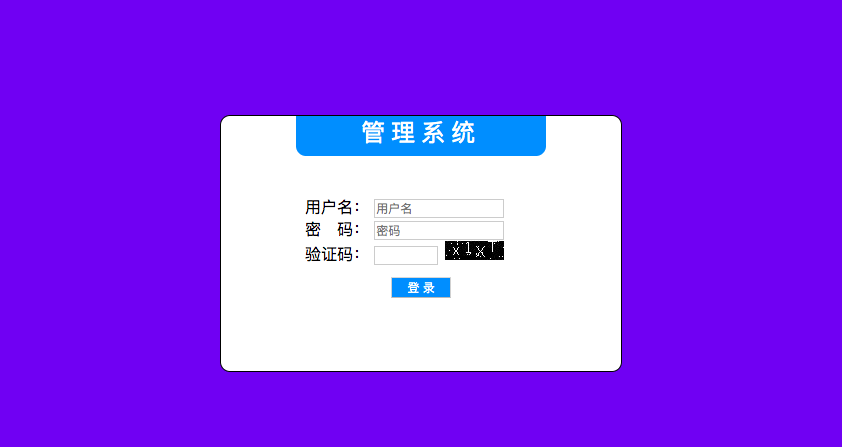
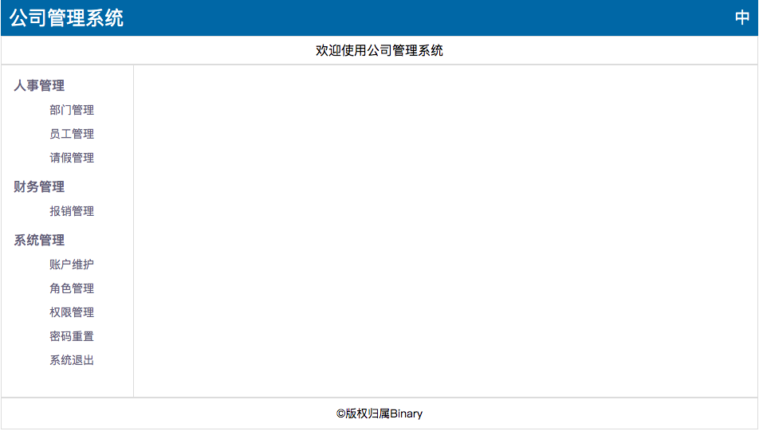
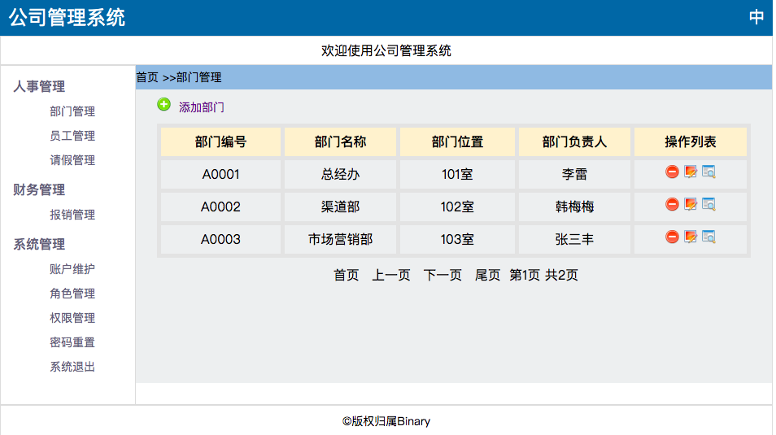
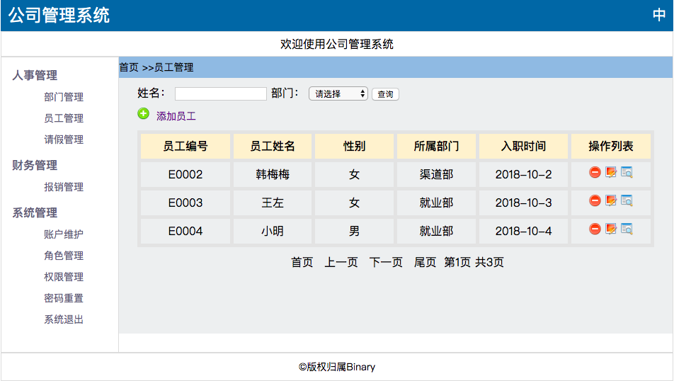
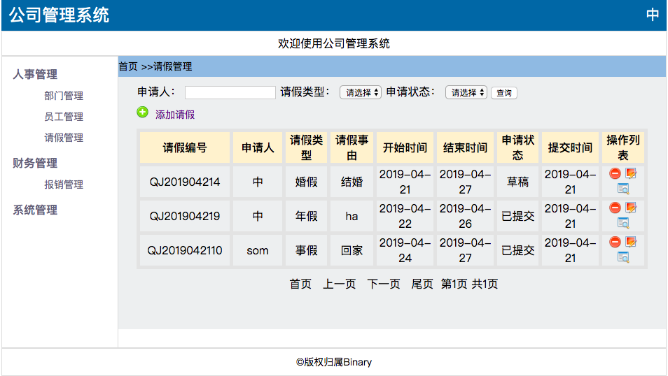
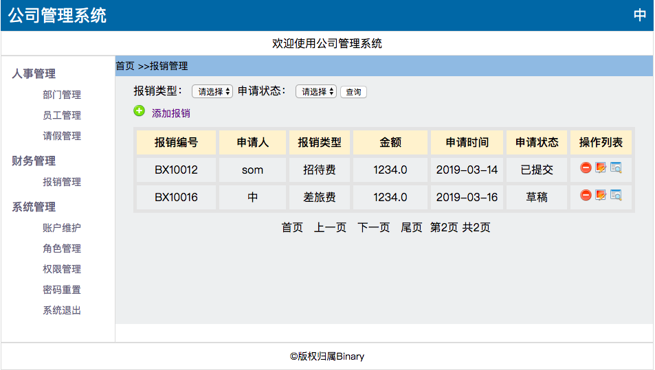
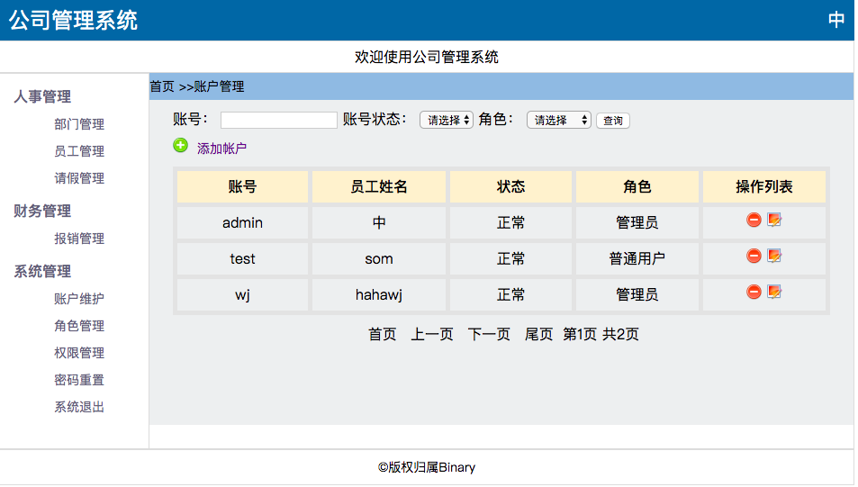
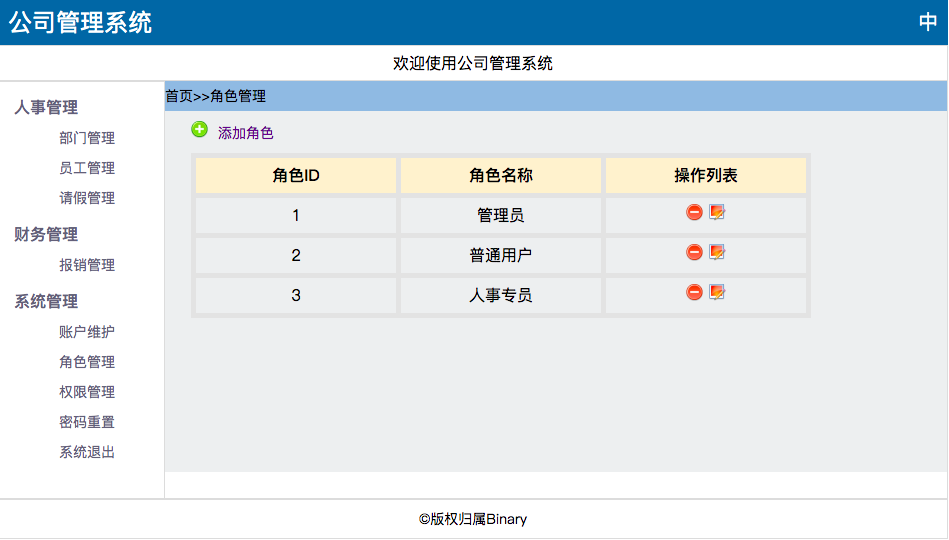
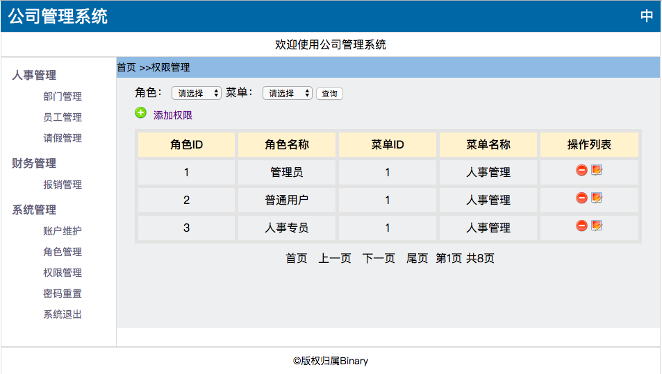
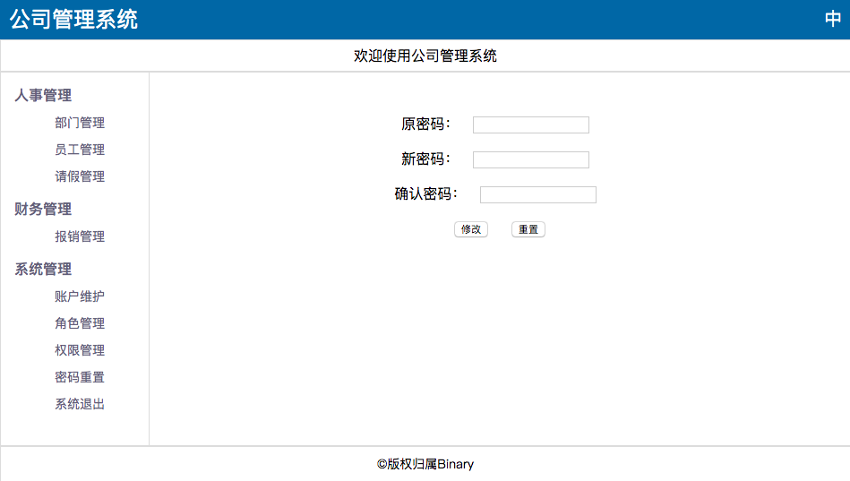

## 公司人员管理系统

### 模式

* 采用MVC模式

### 功能

#### 人事管理

1. 部门管理
2. 员工管理
3. 请假管理
 
#### 账务管理
1. 报销管理

#### 系统管理
1. 账户维护
2. 角色管理
3. 权限管理
4. 密码重置
5. 系统退出

### 系统管理界面

#### 登录界面

#### 主界面

#### 部门管理

#### 员工管理

#### 请假管理

#### 报销管理

#### 账户维护

#### 角色管理

#### 权限管理

#### 密码重置

### 数据库设计

* [数据库表](https://github.com/tudoushell/ManageSystem/wiki/%E6%95%B0%E6%8D%AE%E5%BA%93%E8%A1%A8%E8%AE%BE%E8%AE%A1)

   
